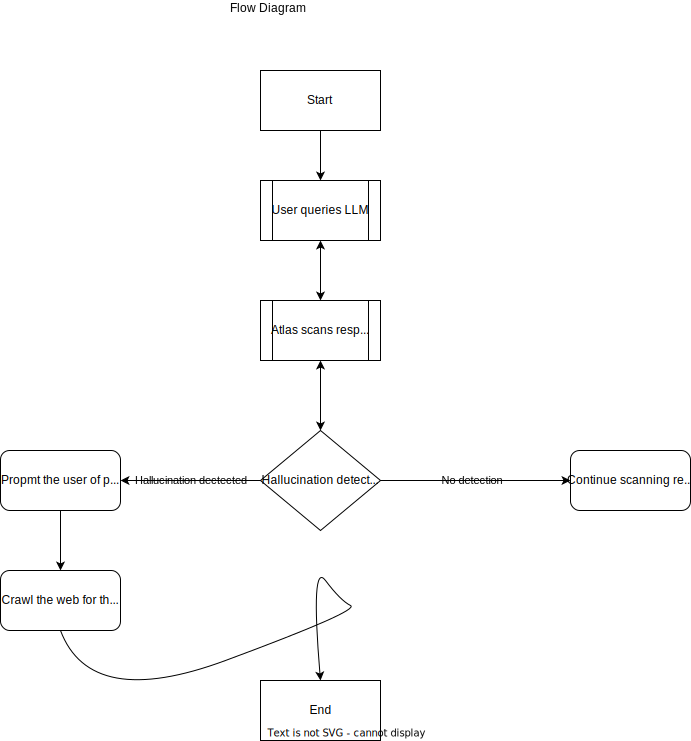

# ATLAS 🌐

Final year project by [Jesse Amarquaye](mailto:jesseamarquayelegendary@gmail.com "Send email") and Greatman Akomea,
computer engineering students from [Ghana Communication Technology University](https://www.gctu.edu.gh "GCTU").

## Table Of Contents

- [Introduction](#introduction)
  - [Why work on hallucination in LLMs?](#why-work-on-hallucination-in-llms)
  - [Why Atlas?](#why-atlas)
  - [Aims or Objectives](#aims-or-objectives)
- [Methodology](#methodology)
  - [Plan](#plan)
- [Results And Analysis](#results-and-analysis)
- [Conclusion](#conclusion)
- [Future Works](#future-works)
- [References](#references)

## Introduction

Atlas is a hallucination detector for Large Language Models.
Its main focus is on **generative text** as that is the most widely used medium for interacting with LLMs.

### Why work on hallucination in LLMs?

Large language models (LLMs) are revolutionizing human-computer interaction, generating increasingly _fluent_ and
_human-like text_.
However, a significant challenge in LLMs is their tendency to produce **hallucinations**, or factually incorrect,
nonsensical, or misleading content.
As humans become increasingly reliant on LLMs for information and decision-making, ensuring their reliability and
accuracy is crucial.
This project aims to address this challenge by developing a software for **detecting** and **mitigating**
hallucinations in LLMs so users can rely on LLM outputs with greater confidence, leading to wider adoption and
societal benefits and also reduces the risk of misinformation to promote responsible use of LLMs.

### Why Atlas?

The story of Atlas in Greek mythology is closely tied to his role in supporting the heavens. According to one myth,
during the _Titanomachy; the war between the Titans and the Olympian gods_, Atlas sided with the Titans. After their
defeat, Zeus condemned Atlas to bear the weight of the heavens on his shoulders for eternity.

The name **Atlas** symbolizes the software's commitment to bearing the responsibility of overseeing the cognitive
aspects of language models, maintaining their stability, and preventing them from collapsing into inaccuracies or
hallucinations. The association with Atlas also conveys _strength_, _resilience_, and _reliability_, suggesting a
software that can handle the weight of complex language processing tasks with steadfastness and precision.

### Aims or Objectives

- [x] Explore techniques for mitigating hallucinations in LLMs.
- [x] Develop a software for automatic detection of hallucinations in LLMs.
- [x] Evaluate the effectiveness of the developed tool in different LLMs.

## Methodology

Our approach will be the design and implementation of a software to detect or flag and mitigate
hallucinations in LLMs.
The ultimate objective is the creation of a ~~browser extension~~ or [website](https://atlasproject-phi.vercel.app "View site") to
actively scan the output from LLMs and
compare them with results from trusted sources on the web and inform the user of any occurrence of hallucinations.

 View Flow Diagram 

### What we plan to do

- Detect and mitigate hallucinations in the form of generated text.

### What we do not plan to do

- ~~Detecting and mitigating hallucination in images generated by LLMs.~~
- ~~Detecting and mitigating hallucination in videos generated by LLMs.~~

### Plan

- [x] Develop an API to search the web. Click to [try it out](https://atlasproject-phi.vercel.app/docs "Test the API").
- [x] Scrape the contents of the resulting links from the search.
- [x] Summarize the contents of the extracted text.
- [x] Identify the difference between the LLM's response and the results from our search.
- [x] Prompt the user of potential hallucinations if any are detected.
- [x] Mitigate by allowing the users to delve deeper and if they are satisfied, substitute the LLM's response with ours.
- [x] Create a site to test how atlas will detect hallucinations in LLMs.
- [x] Create browser extension to finally test how atlas will operate.

## Results And Analysis

During our tests or evaluations we use two of the most popular LLMs, OpenAI's [ChatGPT](https://chatgpt.com "ChatGPT") and
Google's [Gemini](https://gemini.google.com "Gemini").

- ChatGPT returned **120** accurate responses out of 200.
- Gemini returned **98** accurate responses out of 200.

- Both LLMs returned **82** responses that were hallucinations(even though they happened for different questions).

We noticed that _ChatGPT was more accurate than Gemini_ in most cases and Gemini was more prone to hallucinations.

ChatGPT seems to be trained on more data than Gemini and Gemini tried to avoid certain questions but ChatGPT answered all the questions
it could.

The following charts show the results mentioned above.

Number of accurate responses in LLM responses.

Percentage of hallucinations in LLM responses.

## Conclusion

We were able to create a tool that can detect hallucinations in LLMs.
Our tool successfully detects almost all the hallucinations in LLMs.
However, our tool is not perfect and can still be improved since not all information is on the internet and some are inaccurate or contain
biases.

Take a look at our [technical documentation](https://amarquaye.github.io/atlas/ "View technical documentation") or try
our [interactive documentation](https://atlasproject-phi.vercel.app/docs "View interactive documentation") or visit our
[website](https://atlasproject-phi.vercel.app "View website") to learn more about the ATLAS project.

## Future Works

Future works can use this [methodology](https://github.com/amarquaye/atlas-api "Our source code") and combine with other techniques to improve the accuracy of hallucinations detection.

## References

- [A Stitch in Time Saves Nine: Detecting and Mitigating Hallucinations of LLMs by Validating Low-Confidence Generation](https://arxiv.org/pdf/2307.03987)
- [Automatic Calibration and Error Correction for Generative Large Language Models via Pareto Optimal Self-Supervision](https://openreview.net/pdf?id=vg7dECgAw2)
- [Check Your Facts and Try Again Improving Large Language Models with External Knowledge and Automated Feedback](https://arxiv.org/pdf/2302.12813)
- [Constructing Benchmarks and Interventions for Combating Hallucinations in LLMs](https://arxiv.org/pdf/2404.09971)
- [Ever: Mitigating Hallucination in Large Language Models through Real-Time Verification and Rectification](https://arxiv.org/pdf/2311.09114)
- [HILL: A Hallucination Identifier for Large Language Models](https://arxiv.org/pdf/2403.06710)
- [HalluVault: A Novel Logic Programming-aided Metamorphic Testing Framework for Detecting Fact-Conflicting Hallucinations in Large Language Models](https://arxiv.org/pdf/2405.00648)
- [Hallucination Detection: Robustly Discerning Reliable Answers in Large Language Models](https://arxiv.org/pdf/2407.04121)
- [Hallucination Reduction in Large Language Models with Retrieval-Augmented Generation Using Wikipedia Knowledge](https://osf.io/pv7r5/download/?format=pdf)
- [KnowHalu: Hallucination Detection via Multi-Form Knowledge Based Factual Checking](https://arxiv.org/pdf/2404.02935)
- [Lynx: An Open Source Hallucination Evaluation Model](https://arxiv.org/pdf/2407.08488)
- [Mitigating Entity-Level Hallucination in Large Language Models](https://arxiv.org/pdf/2407.09417)
- [Mitigating Hallucinations in Large Language Models via Self-Refinement-Enhanced Knowledge Retrieval](https://arxiv.org/pdf/2405.06545)
- [Reducing Hallucinations in Large Language Models A Consensus Voting Approach Using Mixture of Experts](https://www.techrxiv.org/doi/pdf/10.36227/techrxiv.171925057.75949684/v1)
- [Reducing Hallucinations in Large Language Models Through Contextual Position Encoding](https://osf.io/exjqb/download)
- [Self-Contradictory Hallucinations of LLMs Evaluation, Detection and Mitigation](https://arxiv.org/pdf/2305.15852)
- [The Dawn After the Dark: An Empirical Study on Factuality Hallucination in Large Language Models](https://arxiv.org/pdf/2401.03205)
- [The Troubling Emergence of Hallucination in Large Language Models – An Extensive Definition, Quantification, and Prescriptive Remediations](https://arxiv.org/pdf/2310.04988)
- [Truth-Aware Context Selection: Mitigating the Hallucinations of Large Language Models Being Misled by Untruthful Contexts](https://arxiv.org/pdf/2403.07556)
- [Zero-Shot Multi-task Hallucination Detection](https://arxiv.org/pdf/2403.12244)
