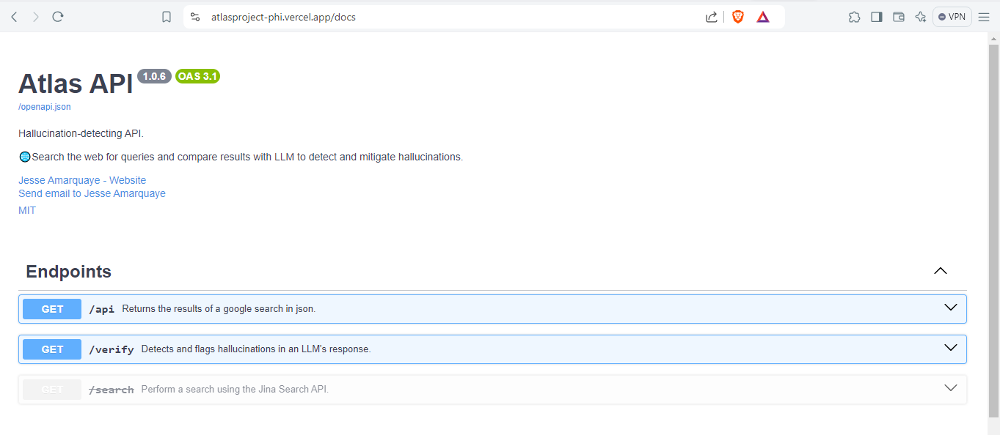
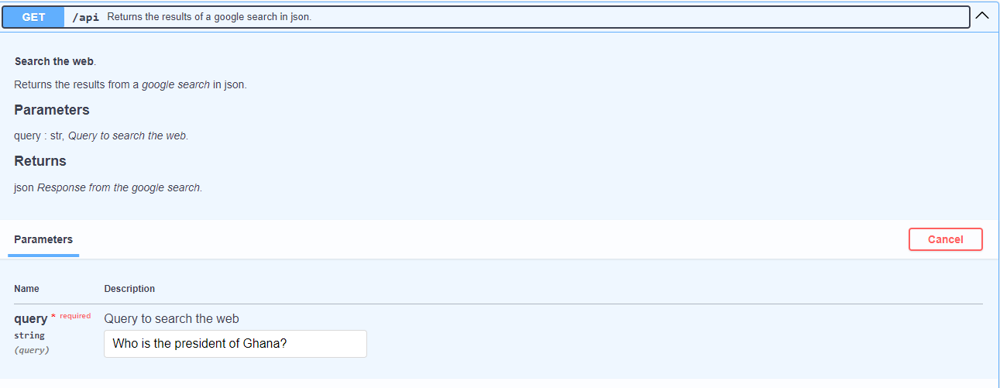
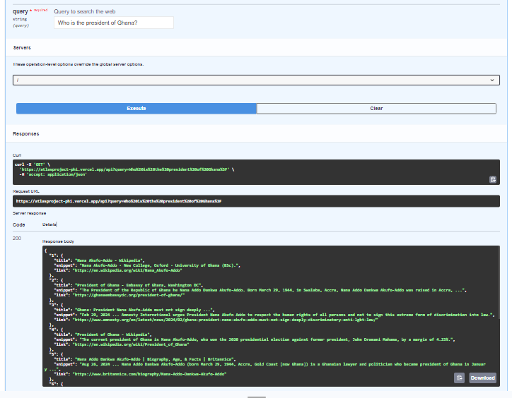
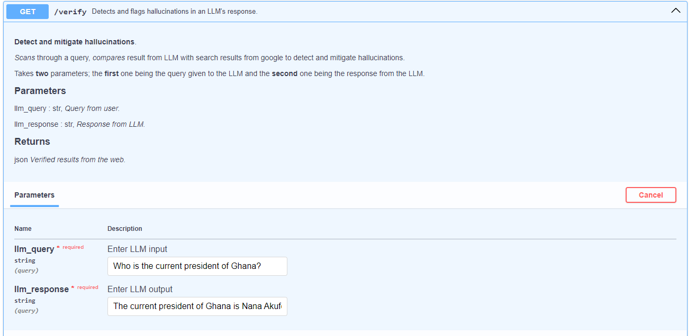
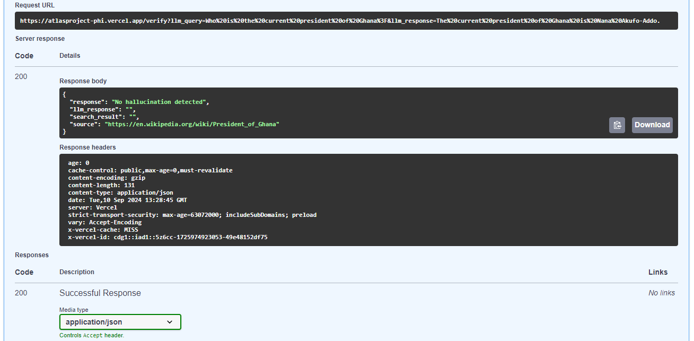
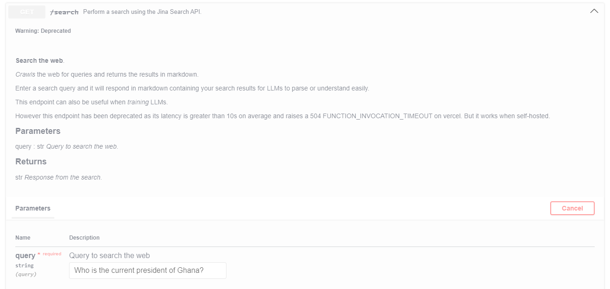
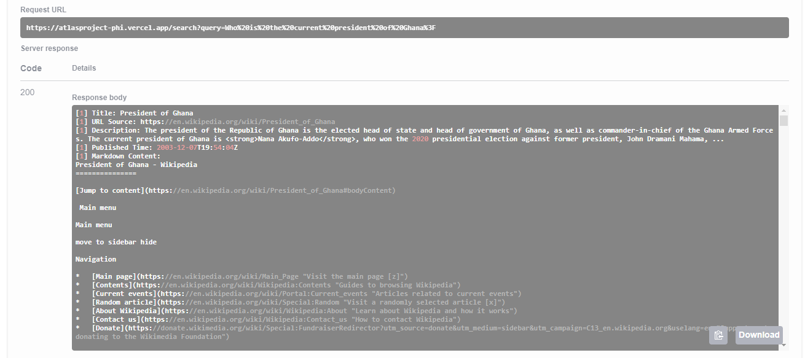

# ATLAS API

## Introduction

The ATLAS API is the bedrock if the entire project.
Made up of three endpoints; `/api`, `/verify` and `/search`, it serves as the gateway to all operations from detection to mitigation.

## Enpoints

### /api

The endpoint takes in a string query as parameter for a google search query as shown in the image below.

!!! example
    

The `/api` endpoint returns the result of a google search query in **json** format as shown below.

!!! example
    

!!! tip
    The `/api` endpoint utilizes the google search API to perform search queries on the web.

### /verify

The enpoint takes in two parameters; the first one being the query given to the LLM.
And the second being the response provided by the LLM.

!!! example
    

The `/verify` endpoint returns an alert in the event that a hallucination has occurred or not.

!!! example
    

!!! note
    It can be observed that in the figure above, the LLM provided the right response and hence did not raise an alert for hallucination detection.

!!! tip
    The `/verify` endpoint utilizes google's [gemini](https://gemini.google.com "Gemini") to scan the response provided
    by the LLM and compares it to the results we got from our google to detect or flag any occurrence of hallucinations.

### /search

This is the last endpoint in the suite of endpoints for the ATLAS project.
This endpoint is however deprecated since it performs a loaded task of retrieving search results from the web
using [jina search](https://jina.ai/ "Jina AI") and returning the results in markdown format.

It takes in one parameter; the search query for the web as shown below.
!!! example
    

It then returns the results from the web search rendered in markdown as shown below.
!!! example
    

!!! tip
    Researchers can use the `/search` endpoint to scrape the web to train their LLMs in an effective way
    to aid in the fight to mitigate or eliminate hallucinations in LLMs.

## License

All the tools under the ATLAS suite are licensed under the [MIT License](https://github.com/amarquaye/atlas-api/blob/master/LICENSE "View LICENSE").
